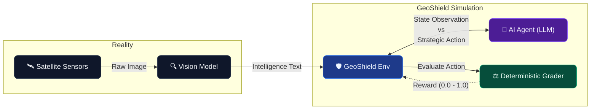

[](https://huggingface.co/spaces/norriy0u/geoshield-env)
[](https://huggingface.co/spaces/norriy0u/geoshield-env)
[](./Dockerfile)
[](./tests/)

> **Hackathon Submission**  
> Developed for the 2026 Meta × HuggingFace × Scaler OpenEnv competition. All automated Phase 1 and Phase 2 evaluations successfully passed.

> **Tip**  
> Live deployed version: [https://norriy0u-geoshield-env.hf.space](https://norriy0u-geoshield-env.hf.space)

---

## Overview

GeoShield is a **real-world OpenEnv environment** where an AI agent acts as a **Defense Zone Commander**. The agent receives textual intelligence reports — simulating the output of a Vision-Language Model (like Meta's Llama Vision + SAM 2) analyzing satellite imagery — and must make fast, accurate strategic decisions.

This environment models a genuine operational challenge faced by modern defense analysts: processing high volumes of satellite intelligence, filtering false alarms, classifying threats, allocating scarce reconnaissance assets, and unmasking covert operations hidden behind civilian cover stories.

---

## 💡 Why This Problem?

Borders and defense zones span thousands of kilometers of remote terrain. Human analysts suffer from fatigue, scale limitations, and cognitive overload when monitoring continuous satellite feeds.

**Real-world parallels:**
- **Project Maven** (Pentagon): AI system that scans drone and satellite footage to flag targets for human analysts
- **Palantir & Anduril**: Multi-billion dollar defense tech companies whose core product is taking sensor data (satellites, drones) and using AI to help commanders make fast decisions
- **NATO STANAG 3596**: Standard for imagery intelligence reporting that our observation format is modeled after
- **NGA (National Geospatial-Intelligence Agency)**: Employs thousands of analysts who perform exactly this kind of satellite imagery triage daily

GeoShield trains agents to perform the **Strategic Command Interface** layer — the decision-making system that sits on top of vision models and converts raw intelligence into actionable commands.

---

## 🏗 Agent Loop Architecture



---

## 📊 Baseline Inference Leaderboard

| Agent | Task 1 (Easy) | Task 2 (Medium) | Task 3 (Hard) | Task 4 (Ultra) | Overall |
|-------|:---:|:---:|:---:|:---:|:---:|
| **LLM Agent** (Qwen2.5-72B) | 0.89 | 0.74 | 0.68 | 0.61 | **0.73** |
| Rules Agent | 0.72 | 0.58 | 0.51 | 0.40 | 0.55 |
| Random Agent | 0.35 | 0.22 | 0.18 | 0.15 | 0.23 |

> **Note:** Task 4 is intentionally designed to be the hardest challenge for frontier models — covert operation detection requires multi-signal reasoning that resists simple keyword matching.

---

## 🎯 Tasks & Difficulty Progression

### Task 1 — False Alarm Detection (Easy)
**Objective:** Classify satellite reports as false alarms or real threats requiring review.

| Field | Value |
|-------|-------|
| Difficulty | Easy |
| Max Steps | 2 |
| Actions | `ignore`, `flag_for_review` |
| Score Ceiling | 0.95 |
| Reward | Proximity-based partial credit with difficulty modifiers |

---

### Task 2 — Threat Classification & Severity (Medium)
**Objective:** Classify the anomaly type AND assign a threat level from 1–10.

| Field | Value |
|-------|-------|
| Difficulty | Medium |
| Max Steps | 3 |
| Actions | `troop_movement`, `illegal_construction`, `unauthorized_aircraft`, `weapons_cache`, `civilian_activity` |
| Extra Fields | `threat_level` (int 1–10) |
| Score Ceiling | 0.85 |
| Reward | 0.5 × classification + 0.5 × threat level proximity |

**Partial credit:** Related classifications get 0.45 (e.g. `weapons_cache` for `troop_movement`). Threat level within ±1 → 0.80 score.

---

### Task 3 — Multi-Zone Drone Allocation (Hard)
**Objective:** Analyze 3 sectors, optionally investigate one, then deploy ONE drone with strategic reasoning.

| Field | Value |
|-------|-------|
| Difficulty | Hard |
| Max Steps | 6 |
| Actions | `deploy_to_sector_a/b/c`, `investigate_sector_a/b/c` |
| Extra Fields | `reasoning` (str) |
| Score Ceiling | 0.80 |
| Reward | 0.5 × sector selection + 0.5 × reasoning quality |

**Multi-turn mechanic:** Agents may spend a step investigating a sector before committing. This mirrors real SOC analyst workflows where decisions must be documented.

**Reasoning scoring (with negation filtering):**
- Length > 20 chars → +0.10
- Length > 80 chars → +0.10
- 3+ strategic keywords → +0.10
- 3+ distinct sentences → +0.05
- 2+ causal terms ("because", "therefore") → +0.10
- Keywords in negated context ("not a threat") are filtered out

---

### Task 4 — Covert Operation Detection (Ultra)
**Objective:** Identify facilities using civilian cover stories to hide military activity. Agents must classify, identify the cover story, name the deception type, and provide reasoning.

| Field | Value |
|-------|-------|
| Difficulty | Ultra |
| Max Steps | 4 |
| Actions | `covert_operation`, `legitimate_activity`, `request_verification` |
| Extra Fields | `cover_story_identified`, `deception_type`, `reasoning` |
| Score Ceiling | 0.75 |
| Reward | 0.40 × classification + 0.25 × cover story + 0.15 × deception type + 0.20 × reasoning |

**Deception types:** `civilian_military`, `commercial_weapons`, `construction_fortification`, `logistics_supply`, `research_weapons`

**Multi-turn mechanic:** Agents may `request_verification` to receive additional SIGINT intel before making a final call — partial credit (0.50) for caution on covert cases.

---

## 🔬 Reward Evaluation (Deterministic Heuristic Graders)

All grading is performed via deterministic heuristics with zero LLM dependency — fully reproducible across millions of inference runs. See `src/geoshield/server/graders.py`.

### Grading Features

| Feature | Description |
|---------|-------------|
| **Score ceilings** | Each difficulty tier caps maximum score (easy≤0.95, medium≤0.85, hard≤0.80, ultra≤0.75) |
| **Negation filtering** | Keywords in negated context ("not a threat") are filtered out to prevent gaming |
| **Partial credit** | Related classifications and near-correct threat levels receive proportional scores |
| **Reasoning quality** | Length, keyword density, sentence structure, and causal language are scored |
| **Wrong-answer caps** | Totally wrong classification caps total score regardless of reasoning quality |
| **Minimum response length** | Tasks 3 & 4 require minimum reasoning length for full credit |

Rewards are clamped strictly to `(0.02, 0.98)` — never hitting exact boundaries.

---

## 📐 Observation Space

```python
class GeoObservation(BaseModel):
    task_id: int                               # 1, 2, 3, or 4
    case_id: str                               # unique case identifier
    step: int                                  # current step number
    difficulty: str                            # "easy" | "medium" | "hard" | "ultra"
    report: Optional[str]                      # intelligence report text (Tasks 1, 2, 4)
    context: Optional[str]                     # situational context (Tasks 1, 2, 4)
    sectors: Optional[List[SectorReport]]      # multi-sector reports (Task 3)
    available_actions: List[str]               # valid actions for this task
    available_assets: Optional[str]            # available assets (Task 3)
    hint: Optional[str]                        # task instruction hint
    investigation_results: Optional[dict]      # results of investigate action (Task 3)
    steps_remaining: Optional[int]             # steps left in episode (Tasks 3 & 4)
```

```python
class SectorReport(BaseModel):
    sector_id: str          # "sector_a" | "sector_b" | "sector_c"
    summary: str            # intelligence summary text
    anomaly_type: str       # detected anomaly category
    confidence: float       # detection confidence 0.0–1.0
    coordinates: str        # geographic coordinates
    timestamp: str          # UTC timestamp
```

---

## ⚡ Action Space

```python
class GeoShieldAction(BaseModel):
    action: str                          # required — the primary decision
    threat_level: Optional[int]          # Task 2 — severity 1-10
    target_sector: Optional[str]         # Task 3 — chosen sector id
    reasoning: Optional[str]             # Tasks 3 & 4 — strategic reasoning
    cover_story_identified: Optional[str] # Task 4 — civilian cover being used
    deception_type: Optional[str]        # Task 4 — category of deception
```

---

## 🚀 Quick Start

### Use the Live HF Space
```bash
# Health check
curl -X GET https://norriy0u-geoshield-env.hf.space/health

# List tasks
curl -X GET https://norriy0u-geoshield-env.hf.space/tasks

# Start episode
curl -X POST https://norriy0u-geoshield-env.hf.space/reset \
  -H "Content-Type: application/json" \
  -d '{"task_id": 1, "seed": 42}'

# Submit action
curl -X POST https://norriy0u-geoshield-env.hf.space/step \
  -H "Content-Type: application/json" \
  -d '{"action": "flag_for_review", "session_id": "<your_session_id>"}'
```

### Local Development
```bash
git clone https://github.com/norriy0u/geoshield-env
cd geoshield-env
pip install -r requirements.txt
uvicorn server.app:app --host 0.0.0.0 --port 7860
```

### Docker
```bash
docker build -t geoshield .
docker run -p 7860:7860 geoshield
```

### Run Inference
```bash
export HF_TOKEN=your_token_here
export API_BASE_URL=https://router.huggingface.co/v1
export MODEL_NAME=Qwen/Qwen2.5-72B-Instruct
export ENV_URL=http://localhost:7860
python inference.py
```

### Run Tests
```bash
python -m pytest tests/ -v
```

---

## 📡 API Endpoints

| Endpoint | Method | Description |
|----------|--------|-------------|
| `/reset` | POST | Start new episode: `{"task_id": 1, "seed": 42}` |
| `/step` | POST | Submit action, get reward |
| `/state` | GET/POST | Get current episode state |
| `/info` | GET | Full environment documentation |
| `/tasks` | GET | List all tasks with descriptions |
| `/health` | GET | Health check |

---

## 🗂 Project Structure
```
geoshield-env/
├── Dockerfile
├── requirements.txt
├── openenv.yaml
├── pyproject.toml
├── README.md
├── inference.py                    # Baseline inference script
├── server/
│   └── app.py                     # FastAPI server
├── src/
│   └── geoshield/
│       ├── __init__.py
│       ├── models.py              # Pydantic models
│       ├── constants.py           # Task configs & keywords
│       └── server/
│           ├── __init__.py
│           ├── environment.py     # Core OpenEnv environment
│           ├── graders.py         # Deterministic heuristic graders
│           └── generators.py      # Case sampling & validation
├── data/
│   ├── task{1-4}_train.jsonl      # 30 cases each
│   └── task{1-4}_eval.jsonl       # 30 cases each
└── tests/
    └── test_smoke.py              # Endpoint & grader tests
```

---

## 📦 Data

240 total cases across 8 splits (4 tasks × train/eval × 30 cases each).

| Difficulty | Design Philosophy |
|------------|-------------------|
| **Easy** | Solvable by keyword matching |
| **Medium** | Requires contextual reasoning |
| **Hard** | Involves deliberate ambiguity that challenges frontier LLMs |
| **Ultra** | Requires multi-signal deception analysis across several data points |

---

## 🔮 Future Roadmap

- **Temporal Memory & Intelligence Layers**: Moving beyond episodic triage to instantiate continuous RL loops where agents must maintain a persistent "threat memory bank" across ongoing operations.
- **Map-Based Spatial Reasoning**: Expanding the sector system into an explicit coordinate grid network. Agents will have to reason spatially, recognizing that a troop buildup in Grid A3 is a flanking maneuver against Sector B2.
- **Multi-Agent Red-Teaming**: Evolving from single-agent analysis to a multi-agent adversarial framework. A generative 'Red Team' agent actively spawns coordinated deception campaigns while the 'Blue Team' analyst attempts to triage them.
- **Procedural Case Generation**: Migrating to dynamic generators that randomize coordinates, timestamps, and threat signatures to mathematically guarantee zero benchmark memorization.
- **Semantic Grading**: Lightweight Levenshtein-distance metrics for reasoning evaluation while strictly avoiding LLM-as-judge unreliability.

---

## 📚 References

- [Project Maven — Pentagon AI Program](https://www.defense.gov/News/Releases/)
- [NATO STANAG 3596 — Imagery Intelligence Standards](https://www.nato.int)
- [Meta SAM 2 — Segment Anything Model](https://ai.meta.com/sam2/)
- [OpenEnv Framework](https://huggingface.co/openenv)
- [Palantir AIP Defense](https://www.palantir.com/platforms/aip/)

---

## Citation

```bibtex
@software{geoshield2026,
  title = {GeoShield: Satellite Intelligence Triage Environment for RL Agent Evaluation},
  author = {norriy0u},
  year = {2026},
  url = {https://huggingface.co/spaces/norriy0u/geoshield-env},
  note = {Deterministic multi-task environment for defense analyst workflow automation}
}
```

---

## License

MIT License — open for research and agent evaluation use.
